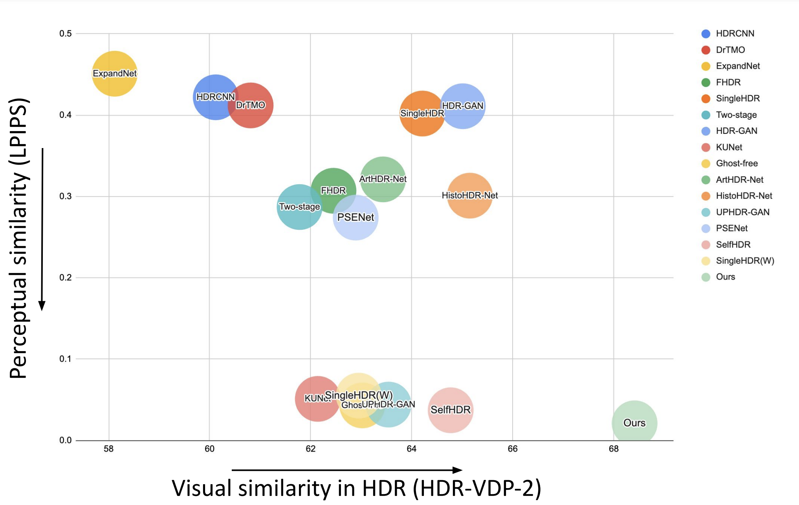
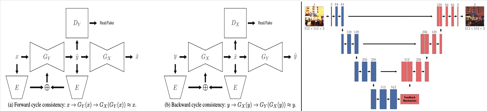

# A Cycle Ride to HDR: Semantics Aware Self-Supervised Framework for Unpaired LDR-to-HDR Image Translation

The official repository of the paper with supplementary: [A Cycle Ride to HDR]()!!

## About the project

This project is carried out at the [Human-Centered AI Lab](https://www.monash.edu/it/hcc/human-centred-ai-lab) in the [Faculty of Information Technology](https://www.monash.edu/it), [Monash University, Melbourne (Clayton), Australia](https://www.monash.edu/).

Project Members - 

[Hrishav Bakul Barua](https://www.researchgate.net/profile/Hrishav-Barua)  [(Monash University and TCS Research, Kolkata, India)](https://www.tcs.com/what-we-do/research),                                                                                                           
[Kalin Stefanov](https://research.monash.edu/en/persons/kalin-stefanov) [(Monash University, Melbourne, Australia)](https://www.monash.edu/),                                                                                                                                                           
[Lemuel Lai En Che](https://www.linkedin.com/in/lemuel-lai-en-che-48984a227/?originalSubdomain=my) [(Monash University, Malaysia)](https://www.monash.edu.my/),                                                                                                                                          
[Abhinav Dhall](https://sites.google.com/site/dhallabhinav/) [(Indian Institute of Technology (IIT) Ropar, India and Flinders University, Adelaide, Australia)](https://www.iitrpr.ac.in/),                                                                                        
[KokSheik Wong](https://scholar.google.com/citations?user=oMjrLWcAAAAJ&hl=en) [(Monash University, Malaysia)](https://www.monash.edu.my/), and                                                                                                                                                
[Ganesh Krishnasami](https://research.monash.edu/en/persons/ganesh-krishnasamy) [(Monash University, Malaysia)](https://www.monash.edu.my/).   

### <ins>Funding details<ins>

This work is supported by the prestigious [`Global Excellence and Mobility Scholarship (GEMS)`](https://www.monash.edu.my/research/support-and-scholarships/gems-scholarship), Monash University. This research is also supported, in part, by the E-Science fund under the project: *Innovative High Dynamic Range Imaging - From Information Hiding to Its Applications* `(Grant No. 01-02-10-SF0327)`. Funding in the form of `Monash IT Student Research (iSR) Scheme 2023` also contributed to this work.  

## Overview

Low Dynamic Range (LDR) to High Dynamic Range (HDR) image translation is an important computer vision problem. There is a significant amount of research utilizing both conventional non-learning methods and modern data-driven approaches, focusing on using both single-exposed and multi-exposed LDR for HDR image reconstruction. However, most current state-of-the-art methods require high-quality paired {LDR,HDR} datasets for model training. In addition, there is limited literature on using unpaired datasets for this task where the model learns a mapping between domains, i.e., LDR ↔ HDR. To address limitations of current methods, such as the paired data constraint, as well as unwanted blurring and visual artifacts in the reconstructed HDR, we propose a method that uses a modified cycle-consistent adversarial architecture and utilizes unpaired {LDR,HDR} datasets for training. The method introduces novel generators to address visual artifact removal and an encoder and loss to address semantic consistency, another under-explored topic. The method achieves state-of-the-art results across several benchmark datasets and reconstructs high-quality HDR images.

## State-of-the-art comparision

### <ins>Comparision summary table</ins>

| Method                |    Input    | Output | Unpaired | Context-aware | Semantics | Artifacts | Tone-mapping |
| --------------------- | ------------- | -------------| -------------| -------------| -------------| -------------| -------------| 
| [PSENet (WACV'23)](https://github.com/whai362/PSENet)  | SE | D | :x: | :x: | :x: | :x: | :x: |
| [SingleHDR(W) (WACV'23)](https://github.com/VinAIResearch/single_image_hdr)    | SE | I | :x: | :x: | :x: | :x: | :x: |
| [UPHDR-GAN (TCSVT'22)](https://github.com/liru0126/UPHDR-GAN) | ME | D | :white_check_mark: |:x: | :x: |  :white_check_mark: | :x: |
| [SelfHDR (ICLR'24)](https://github.com/cszhilu1998/SelfHDR) | ME | I | :x:  | :x: | :x: |  :white_check_mark: | :x: |
| [KUNet (IJCAI'22)](https://github.com/wanghu178/KUNet)   | SE | D | :x: | :x: |  :white_check_mark: | :x: | :x: |
| [Ghost-free HDR (ECCV'22)](https://github.com/megvii-research/HDR-Transformer)  | ME | D | :x: |  :white_check_mark: | :x: |  :white_check_mark: | :x: |
| [DITMO](https://arxiv.org/abs/2405.15468)   | SE | I | :x: | :x: |  :white_check_mark: |  :white_check_mark: | :x: |
| **(ours)** | SE  | D |  :white_check_mark:| :white_check_mark: | :white_check_mark: | :white_check_mark: | :white_check_mark: |

## Our work utilizes the following awesome works and datasets:

### <ins>State-of-the-art DL models for LDR to HDR reconstruction/translation</ins>

#### Supervised: ####

`ACM TOG 2017` | `HDRCNN` - HDR image reconstruction from a single exposure using deep CNNs | [Code](https://github.com/gabrieleilertsen/hdrcnn)

`ACM TOG 2017` | `DrTMO` - Deep Reverse Tone Mapping | [Code](https://github.com/shleecs/DrTMO_unofficial_pytorch)

`Eurographics 2018` | `ExpandNet` - A Deep Convolutional Neural Network for High Dynamic Range Expansion from Low Dynamic Range Content | [Code](https://github.com/dmarnerides/hdr-expandnet)

`GlobalSIP 2019` | `FHDR` - HDR Image Reconstruction from a Single LDR Image using Feedback Network | [Code](https://github.com/mukulkhanna/FHDR)

`CVPR 2020` | `SingleHDR` - Single-Image HDR Reconstruction by Learning to Reverse the Camera Pipeline | [Code](https://github.com/alex04072000/SingleHDR) 

`CVPRW 2021` | `Two-stage HDR` - A two-stage deep network for high dynamic range image reconstruction | [Code](https://github.com/sharif-apu/twostageHDR_NTIRE21)

`IEEE TIP 2021` | `HDR-GAN` - HDR Image Reconstruction from Multi-Exposed LDR Images with Large Motions | [Code](https://github.com/nonu116/HDR-GAN)

`IJCAI 2022` | `KUNet` - Imaging Knowledge-[PSENet (WACV'23)](https://github.com/whai362/PSENet) Single HDR Image Reconstruction | [Code](https://github.com/wanghu178/KUNet)

`ECCV 2022` | `Ghost-free HDR` - Ghost-free High Dynamic Range Imaging with Context-aware Transformer | [Code](https://github.com/megvii-research/HDR-Transformer)

`APSIPA 2023` | `ArtHDR-Net` - Perceptually Realistic and Accurate HDR Content Creation | [Code](https://arxiv.org/abs/2309.03827#:~:text=ArtHDR%2DNet%3A%20Perceptually%20Realistic%20and%20Accurate%20HDR%20Content%20Creation,-Hrishav%20Bakul%20Barua&text=High%20Dynamic%20Range%20(HDR)%20content,and%20Augmented%2FVirtual%20Reality%20industries.)

 `ICIP 2024` | `HistoHDR-Net` - Histogram Equalization for Single LDR to HDR Image
Translation| [Code](https://arxiv.org/pdf/2402.06692.pdf)

#### Unsupervised/weakly-supervised/self-supervised: ####

`IEEE TCSVT 2022` | `UPHDR-GAN` - Generative Adversarial Network for High Dynamic Range Imaging with Unpaired Data | [Code](https://github.com/liru0126/UPHDR-GAN)

`WACV 2023` | `PSENet` - Progressive Self-Enhancement Network for Unsupervised Extreme-Light Image Enhancement | [Code](https://github.com/whai362/PSENet)

`WACV 2023` | `SingleHDR` - Single-Image HDR Reconstruction by Multi-Exposure Generation | [Code](https://github.com/VinAIResearch/single_image_hdr)

`ICLR 2024` | `SelfHDR` - Self-Supervised High Dynamic Range Imaging with Multi-Exposure Images in Dynamic Scenes | [Code](https://github.com/cszhilu1998/SelfHDR)

### <ins>State-of-the-art DL datasets for LDR to HDR reconstruction/translation</ins>

`VPQM 2015` | `HDR-Eye` - Visual attention in LDR and HDR images | [Link](https://www.epfl.ch/labs/mmspg/downloads/hdr-eye/)

`ACM TOG 2017` | `Kalantari` *et al.* - Deep high dynamic range imaging of dynamic scenes | [Link](https://cseweb.ucsd.edu/~viscomp/projects/SIG17HDR/)

`IEEE Access 2020` | `LDR-HDR Pair` - Dynamic range expansion using cumulative histogram learning for high dynamic range image generation | [Link](https://github.com/HanbyolJang/LDR-HDR-pair_Dataset/tree/master)

`CVPR 2020` | `HDR-Synth & HDR-Real` - Single-image HDR reconstruction by learning to reverse the camera pipeline | [Link](https://github.com/alex04072000/SingleHDR)

`ICCV 2021` | `HDRTV` - A New Journey from SDRTV to HDRTV | [Link](https://github.com/chxy95/HDRTVNet?tab=readme-ov-file#dataset)

`CVPR 2021` | `NTIRE` - Ntire 2021 challenge on high dynamic range imaging: Dataset, methods and results.| [Link](https://data.vision.ee.ethz.ch/cvl/ntire21/)

`ACM TOG 2017` | `DrTMO` - Deep Reverse Tone Mapping | [Link](https://github.com/shleecs/DrTMO_unofficial_pytorch/blob/master/README.md)

`GTA-HDR` -  A Large-Scale Synthetic Dataset for HDR Image Reconstruction | [Link](https://github.com/HrishavBakulBarua/GTA-HDR)

