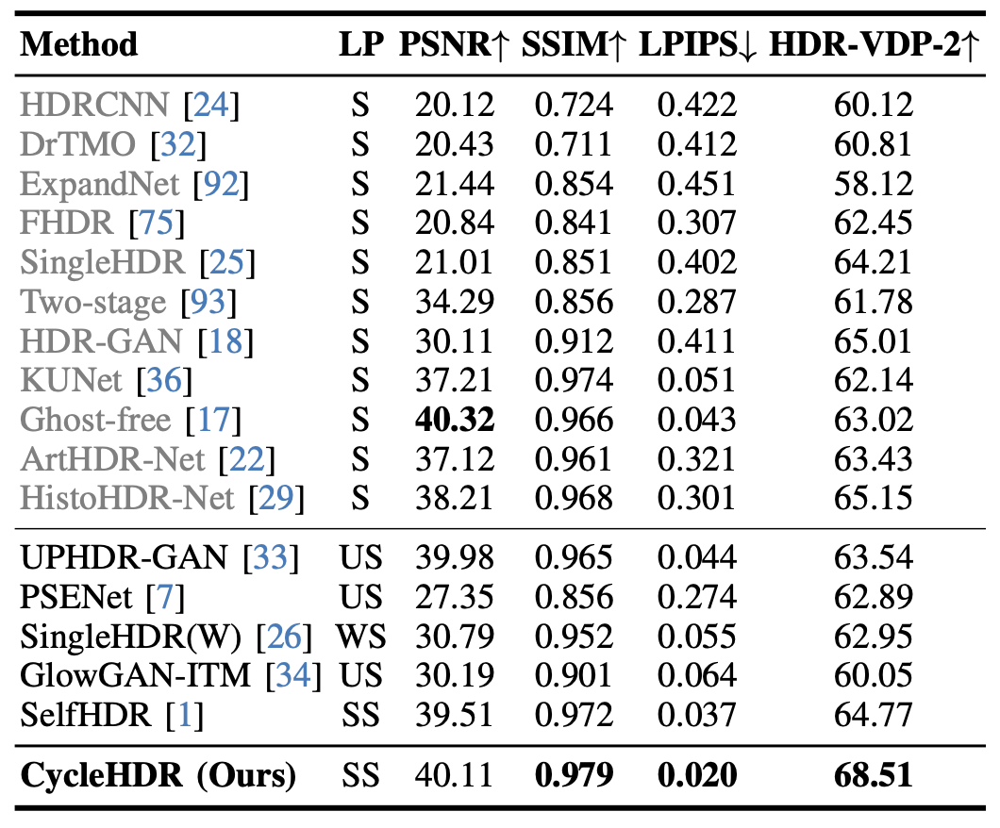

# LLM-HDR: Bridging LLM-based Perception and Self-Supervision for Unpaired LDR-to-HDR Image Reconstruction

The official repository of the paper with supplementary:  | 

## About the project

This project is carried out at the [Human-Centered AI Lab](https://www.monash.edu/it/hcc/human-centred-ai-lab) in the [Faculty of Information Technology](https://www.monash.edu/it), [Monash University, Melbourne (Clayton), Australia](https://www.monash.edu/).

Project Members - 

[Hrishav Bakul Barua](https://www.researchgate.net/profile/Hrishav-Barua)  [(Monash University and TCS Research, Kolkata, India)](https://www.tcs.com/what-we-do/research),                                                                                                           
[Kalin Stefanov](https://research.monash.edu/en/persons/kalin-stefanov) [(Monash University, Melbourne, Australia)](https://www.monash.edu/),                                                                                                                                                           
[Lemuel Lai En Che](https://www.linkedin.com/in/lemuel-lai-en-che-48984a227/?originalSubdomain=my) [(Monash University, Malaysia)](https://www.monash.edu.my/),                                                                                                                                          
[Abhinav Dhall](https://sites.google.com/site/dhallabhinav/) [(Indian Institute of Technology (IIT) Ropar, India and Flinders University, Adelaide, Australia)](https://www.iitrpr.ac.in/),                                                                                        
[KokSheik Wong](https://scholar.google.com/citations?user=oMjrLWcAAAAJ&hl=en) [(Monash University, Malaysia)](https://www.monash.edu.my/), and                                                                                                                                                
[Ganesh Krishnasami](https://research.monash.edu/en/persons/ganesh-krishnasamy) [(Monash University, Malaysia)](https://www.monash.edu.my/).

For any quries kindly contact: `hbarua@acm.org`/ `hrishav.barua@ieee.org`

### <ins>Funding details<ins>

This work is supported by the prestigious [`Global Excellence and Mobility Scholarship (GEMS)`](https://www.monash.edu.my/research/support-and-scholarships/gems-scholarship), Monash University and a *GRS Supplementary Grant Award* `[Grant No. RMO/L-GRS(SF)/2025-004]` from School Postgraduate and Research Committee (SPRC), Monash University. This research is also supported, in part, by the E-Science fund under the project: *Innovative High Dynamic Range Imaging - From Information Hiding to Its Applications* `(Grant No. 01-02-10-SF0327)`. Funding in the form of `Monash IT Student Research (iSR) Scheme 2023` also contributed to this work.  

## Overview

The below image is a qualitative comparison of the proposed **LLM-HDR** method and state-of-the-art method [SelfHDR](https://github.com/cszhilu1998/SelfHDR) (`ICLR'24`). We see, our method handles the overexposed portions in the sky more realistically.

The translation of Low Dynamic Range (LDR) to High Dynamic Range (HDR) images is an important computer vision task. There is a significant amount of research utilizing both conventional non-learning methods and modern data-driven approaches, focusing on using both single-exposed and multi-exposed LDR for HDR image reconstruction. However, most current state-of-the-art methods require high-quality paired {LDR,HDR} datasets for model training. In addition, there is limited literature on using unpaired datasets for this task, that is, the model learns a mapping between domains, i.e., LDR ↔ HDR. This paper proposes LLM-HDR, a method that integrates the perception of Large Language Models (LLM) into a modified semantic- and cycle-consistent adversarial architecture that utilizes unpaired {LDR,HDR} datasets for training. The method introduces novel artifact- and exposure-aware generators to address visual artifact removal and an encoder and loss to address semantic consistency, another under-explored topic. LLM-HDR is the first to use an LLM for the LDR ↔ HDR translation task in a self-supervised setup. The method achieves state-of-the-art performance across several benchmark datasets and reconstructs high-quality HDR images.

**Left**: Overview of the proposed method architecture where *x* and *y* represent LDR and HDR images, respectively. The method is trained with six objectives: adversarial, cycle consistency, identity, LLM-based, contrastive, and semantic segmentation. *GX* and *GY* are the generators while *DX* and *DY* are the discriminators. *E(.)* is the Contrastive Language-Image Pretraining - CLIP encoder. **Right**: Overview of the proposed generators based on our novel feedback based U-Net architecture. 
Left part ($${\color{blue}Blue}$$) is the encoder and
right part ($${\color{red}Red}$$) is the decoder. The decoder is inside the feedback iteration loop.

Overview of the proposed LLM module. Q&A sessions include: **User prompt**: “Tell me if there are any synthesis artifacts
in the given scene or not. Must response with 1) Yes or No only, 2) If Yes, can you get me the saliency maps of the artifacts (in $${\color{red}Red}$$),
overexposed (in ($${\color{blue}Blue}$$) and underexposed (in $${\color{yellow}Yellow}$$) areas of this image?”, **System**: “Outputs the saliency maps for the detected artifacts
in red, overexposed pixels in blue, and underexposed pixels in yellow.”

**Please check out the paper for more details!!**

### Loss mechanisms

Depiction of the LLM-based loss Lllm. Q&A sessions
include: **User prompt**: “Tell me if there are any synthesis artifacts
in the given scene or not. Must response with 1) Yes or No only, 2)
If Yes, return the [artifact areas number of pixels, total number of
pixels]. Also highlight the artifact areas with $${\color{pink}Pink}$$. Similarly find
if there are any over/under exposure areas in the scene and return
the [pixels in overexposure, pixels in underexposure areas] and
highlight the overexposed areas in $${\color{blue}Blue}$$ and underexposed areas in
$${\color{green}Green}$$.”, **System**: “Outputs the number of pixels with the pixel list
(in .txt files) for the detected artifacts in pink, overexposed pixels
in blue, and underexposed pixels in green.”

Depiction of the cycle consistency loss *Lcyc* using an
image from the [DrTMO](https://github.com/shleecs/DrTMO_unofficial_pytorch/blob/master/README.md) dataset.

**Left**: Depiction of the contrastive loss *Lcon*. Positive
($${\color{green}green}$$) and negative ($${\color{red}Red}$$) pairs in a batch. We use a histogram-
equalized version of the LDR processed using the OpenCV func-
tion equalizeHist. **Right**: Depiction of the semantic segmentation loss *Lsem*.
We use [Segment Anything (SAM)](https://arxiv.org/abs/2304.02643) to generate segmentation
classes in the histogram-equalized LDR and reconstructed tone-mapped HDR images.

**Please check out the paper for more details!!**

## State-of-the-art comparision in high level parameters

### <ins>Comparision summary table</ins>

| Method                |    Input    | Output | Unpaired | LLM | Context-aware | Semantics | Artifacts | Tone-mapping |
| --------------------- | ------------- | -------------| ------------- | ------ | -------------| -------------| -------------| -------------| 
| [PSENet (WACV'23)](https://github.com/whai362/PSENet)  | SE | D | :x: | :x: | :x: | :x: | :x: | :x: |
| [SingleHDR(W) (WACV'23)](https://github.com/VinAIResearch/single_image_hdr)    | SE | I | :x: | :x: | :x: | :x: | :x: | :x: |
| [UPHDR-GAN (TCSVT'22)](https://github.com/liru0126/UPHDR-GAN) | ME | D | :white_check_mark: |:x: | :x: | :x: |  :white_check_mark: | :x: |
| [SelfHDR (ICLR'24)](https://github.com/cszhilu1998/SelfHDR) | ME | I | :x:  | :x: | :x: | :x: |  :white_check_mark: | :x: |
| [KUNet (IJCAI'22)](https://github.com/wanghu178/KUNet)   | SE | D | :x: | :x: | :x: |  :white_check_mark: | :x: | :x: |
| [Ghost-free HDR (ECCV'22)](https://github.com/megvii-research/HDR-Transformer)  | ME | D | :x: | :x: |  :white_check_mark: | :x: |  :white_check_mark: | :x: |
| [GlowGAN-ITM (ICCV'23)](https://github.com/Hans1984/GlowGAN)  | SE | D | :white_check_mark: | :x: |  :x: | :x: |  :white_check_mark: | :x: |
| [DITMO](https://arxiv.org/abs/2405.15468)   | SE | I | :x: | :x: | :x: |  :white_check_mark: |  :white_check_mark: | :x: |
| **LLM-HDR (ours)** | SE  | D |  :white_check_mark:| :white_check_mark:| :white_check_mark: | :white_check_mark: | :white_check_mark: | :white_check_mark: |

Input: LDR
used as input (SE: Single-exposed and ME: Multi-exposed), Output:
Reconstructs directly HDR (D) or multi-exposed LDR stack (I),
Unpaired: Uses unpaired data, Context-aware: Uses local/global image
information and relationship among entities in the image, Semantics: Uses color/texture information and identity of the items in
the image, Artifacts: Handles visual artifacts, Tone-mapping: Also performs
tone-mapping i.e. HDR → LDR.

## Experiments and Results
###  LDR → HDR:

HDR reconstruction (inverse tone-mapping) learned with
our self-supervised learning approach. Quantitative comparison
with supervised (gray) and unsupervised/weakly-supervised/self-
supervised (black) learning methods trained on the paired datasets
[HDRTV](https://github.com/chxy95/HDRTVNet?tab=readme-ov-file#dataset), [NTIRE](https://data.vision.ee.ethz.ch/cvl/ntire21/), and [HDR-Synth & HDR-Real](https://github.com/alex04072000/SingleHDR). **LP**: Supervised (S), unsupervised (US), weakly-
supervised (WS), and self-supervised (SS).

### HDR → LDR:

LDR reconstruction (tone-mapping) learned with our self-
supervised learning approach. Quantitative comparison with the
state-of-the-art one-mapping operators.

Comparison of the [SingleHDR(W)](https://github.com/VinAIResearch/single_image_hdr) U-Net with and without our feedback mechanism on images from the [DrTMO](https://github.com/shleecs/DrTMO_unofficial_pytorch/blob/master/README.md) dataset.  It illustrates the improvement in [SingleHDR(W)](https://github.com/VinAIResearch/single_image_hdr) when we use the proposed feedback U-Net (mod) instead of the original U-Net of SingleHDR(W). The original U-Net produces many artifacts in the output HDR
images whereas our modified version with feedback reconstructs artifact-free HDR images. 

**Please check out the paper for more details!!**

## Visual results

You may check some [sample visual results](output_samples). 

**Note** The output/input HDR images (in .hdr format) generated by our pipeline can be viewed using [OpenHDRViewer](https://viewer.openhdr.org/).

**Please check out the paper for more details!!**

## Our work utilizes the following awesome works and datasets:

### <ins>State-of-the-art DL models for LDR → HDR reconstruction/translation</ins>

#### Supervised: ####

`ACM TOG 2017` | `HDRCNN` - HDR image reconstruction from a single exposure using deep CNNs | [Code](https://github.com/gabrieleilertsen/hdrcnn)

`ACM TOG 2017` | `DrTMO` - Deep Reverse Tone Mapping | [Code](https://github.com/shleecs/DrTMO_unofficial_pytorch)

`Eurographics 2018` | `ExpandNet` - A Deep Convolutional Neural Network for High Dynamic Range Expansion from Low Dynamic Range Content | [Code](https://github.com/dmarnerides/hdr-expandnet)

`GlobalSIP 2019` | `FHDR` - HDR Image Reconstruction from a Single LDR Image using Feedback Network | [Code](https://github.com/mukulkhanna/FHDR)

`CVPR 2020` | `SingleHDR` - Single-Image HDR Reconstruction by Learning to Reverse the Camera Pipeline | [Code](https://github.com/alex04072000/SingleHDR) 

`CVPRW 2021` | `Two-stage HDR` - A two-stage deep network for high dynamic range image reconstruction | [Code](https://github.com/sharif-apu/twostageHDR_NTIRE21)

`IEEE TIP 2021` | `HDR-GAN` - HDR Image Reconstruction from Multi-Exposed LDR Images with Large Motions | [Code](https://github.com/nonu116/HDR-GAN)

`IJCAI 2022` | `KUNet` - Imaging Knowledge-Inspired Single HDR Image Reconstruction | [Code](https://github.com/wanghu178/KUNet)

`ECCV 2022` | `Ghost-free HDR` - Ghost-free High Dynamic Range Imaging with Context-aware Transformer | [Code](https://github.com/megvii-research/HDR-Transformer)

`APSIPA 2023` | `ArtHDR-Net` - Perceptually Realistic and Accurate HDR Content Creation | [Code](https://arxiv.org/abs/2309.03827#:~:text=ArtHDR%2DNet%3A%20Perceptually%20Realistic%20and%20Accurate%20HDR%20Content%20Creation,-Hrishav%20Bakul%20Barua&text=High%20Dynamic%20Range%20(HDR)%20content,and%20Augmented%2FVirtual%20Reality%20industries.)

 `ICIP 2024` | `HistoHDR-Net` - Histogram Equalization for Single LDR to HDR Image
Translation| [Code](https://arxiv.org/pdf/2402.06692.pdf)

`ICCV 2023` | `RawHDR` - High Dynamic Range Image Reconstruction from a Single Raw Image | [Code](https://github.com/yunhao-zou/RawHDR)

#### Unsupervised/weakly-supervised/self-supervised: ####

`IEEE TCSVT 2022` | `UPHDR-GAN` - Generative Adversarial Network for High Dynamic Range Imaging with Unpaired Data | [Code](https://github.com/liru0126/UPHDR-GAN)

`WACV 2023` | `PSENet` - Progressive Self-Enhancement Network for Unsupervised Extreme-Light Image Enhancement | [Code](https://github.com/whai362/PSENet)

`WACV 2023` | `SingleHDR(W)` - Single-Image HDR Reconstruction by Multi-Exposure Generation | [Code](https://github.com/VinAIResearch/single_image_hdr)

`ICCV 2023` | `GlowGAN-ITM` - : Unsupervised Learning of HDR Images from LDR Images in the Wild | [Code](https://github.com/Hans1984/GlowGAN)

`ICLR 2024` | `SelfHDR` - Self-Supervised High Dynamic Range Imaging with Multi-Exposure Images in Dynamic Scenes | [Code](https://github.com/cszhilu1998/SelfHDR)

### <ins>State-of-the-art DL datasets for LDR → HDR reconstruction/translation</ins>

`VPQM 2015` | `HDR-Eye` - Visual attention in LDR and HDR images | [Dataset](https://www.epfl.ch/labs/mmspg/downloads/hdr-eye/)

`ACM TOG 2017` | `Kalantari` *et al.* - Deep high dynamic range imaging of dynamic scenes | [Dataset](https://cseweb.ucsd.edu/~viscomp/projects/SIG17HDR/)

`IEEE Access 2020` | `LDR-HDR Pair` - Dynamic range expansion using cumulative histogram learning for high dynamic range image generation | [Dataset](https://github.com/HanbyolJang/LDR-HDR-pair_Dataset/tree/master)

`CVPR 2020` | `HDR-Synth & HDR-Real` - Single-image HDR reconstruction by learning to reverse the camera pipeline | [Dataset](https://github.com/alex04072000/SingleHDR)

`ICCV 2021` | `HDRTV` - A New Journey from SDRTV to HDRTV | [Dataset](https://github.com/chxy95/HDRTVNet?tab=readme-ov-file#dataset)

`CVPR 2021` | `NTIRE` - Ntire 2021 challenge on high dynamic range imaging: Dataset, methods and results.| [Dataset](https://data.vision.ee.ethz.ch/cvl/ntire21/)

`ACM TOG 2017` | `DrTMO` - Deep Reverse Tone Mapping | [Dataset](https://github.com/shleecs/DrTMO_unofficial_pytorch/blob/master/README.md)

`WACV 2025` | `GTA-HDR` -  A Large-Scale Synthetic Dataset for HDR Image Reconstruction | [Dataset](https://github.com/HrishavBakulBarua/GTA-HDR)

### <ins>Popular HDR → LDR tome-mapping operators used</ins>

`μ-law operator` | [Link](https://search.ieice.org/bin/summary.php?id=e94-a_3_972)

`Reinhard's operator` | [Link](https://dl.acm.org/doi/10.1145/566654.566575)

`Photomatix` | [Link](https://www.hdrsoft.com/)

`GlowGAN-prior` | [Link](https://github.com/Hans1984/GlowGAN)

### <ins>Evaluation metrices used</ins>

`PSNR` - Peak Signal to Noise Ratio | [Link](https://ieeexplore.ieee.org/document/6146669)    

`SSIM` - Structural Similarity Index Measure | [Link](https://www.cns.nyu.edu/pub/lcv/wang03-preprint.pdf)        

`LPIPS` - Learned Perceptual Image Patch Similarity | [Link](https://arxiv.org/abs/1801.03924)

`HDR-VDP-2` -  High Dynamic Range Visual Differences Predictor | [Link](https://dl.acm.org/doi/10.1145/2010324.1964935)

##  Citation 

If you find our work (i.e., the code, the theory/concept, or the dataset) useful for your research or development activities, please consider citing our work as follows:

~~~
@article{barua2024cycle,
  title={A Cycle Ride to HDR: Semantics Aware Self-Supervised Framework for Unpaired LDR-to-HDR Image Translation},
  author={Barua, Hrishav Bakul and Kalin, Stefanov and Che, Lemuel Lai En and Abhinav, Dhall and KokSheik, Wong and Ganesh, Krishnasamy},
  journal={arXiv preprint arXiv:2410.15068},
  year={2024}
}
~~~

~~~
@InProceedings{Barua_2025_WACV,
    author    = {Barua, Hrishav Bakul and Stefanov, Kalin and Wong, KokSheik and Dhall, Abhinav and Krishnasamy, Ganesh},
    title     = {GTA-HDR: A Large-Scale Synthetic Dataset for HDR Image Reconstruction},
    booktitle = {Proceedings of the Winter Conference on Applications of Computer Vision (WACV)},
    month     = {February},
    year      = {2025},
    pages     = {7865-7875}
}
~~~
Related works: 
~~~
@inproceedings{barua2023arthdr,
  title={ArtHDR-Net: Perceptually Realistic and Accurate HDR Content Creation},
  author={Barua, Hrishav Bakul and Krishnasamy, Ganesh and Wong, KokSheik and Stefanov, Kalin and Dhall, Abhinav},
  booktitle={2023 Asia Pacific Signal and Information Processing Association Annual Summit and Conference (APSIPA ASC)},
  pages={806--812},
  year={2023},
  organization={IEEE}
}
~~~
~~~
@inproceedings{barua2024histohdr,
  title={HistoHDR-Net: Histogram equalization for single LDR to HDR image translation},
  author={Barua, Hrishav Bakul and Krishnasamy, Ganesh and Wong, KokSheik and Dhall, Abhinav and Stefanov, Kalin},
  booktitle={2024 IEEE International Conference on Image Processing (ICIP)},
  pages={2730--2736},
  year={2024},
  organization={IEEE}
}
~~~

## License and Copyright

~~~
----------------------------------------------------------------------------------------
Copyright 2024 | All the authors and contributors of this repository as mentioned above.
----------------------------------------------------------------------------------------

~~~

Please check the [License](LICENSE) Agreement.

