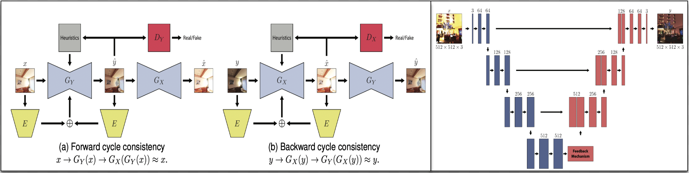

# A Cycle Ride to HDR: Semantics Aware Self-Supervised Framework for Unpaired LDR-to-HDR Image Translation

The official repository of the paper with supplementary: [A Cycle Ride to HDR]()!!

## About the project

This project is carried out in [Monash University, Melbourne, Australia](https://www.monash.edu/).

Project Members - 

[Hrishav Bakul Barua](https://www.researchgate.net/profile/Hrishav-Barua)  [(Monash University and TCS Research, Kolkata, India)](https://www.tcs.com/what-we-do/research),                                                                                                           
[Kalin Stefanov](https://research.monash.edu/en/persons/kalin-stefanov) [(Monash University, Melbourne, Australia)](https://www.monash.edu/),                                                                                                                                                           
[Lemuel Lai En Che](https://www.linkedin.com/in/lemuel-lai-en-che-48984a227/?originalSubdomain=my) [(Monash University, Malaysia)](https://www.monash.edu.my/),                                                                                                                                          
[Abhinav Dhall](https://sites.google.com/site/dhallabhinav/) [(Indian Institute of Technology (IIT) Ropar, India and Flinders University, Adelaide, Australia)](https://www.iitrpr.ac.in/),                                                                                        
[KokSheik Wong](https://scholar.google.com/citations?user=oMjrLWcAAAAJ&hl=en) [(Monash University, Malaysia)](https://www.monash.edu.my/), and                                                                                                                                                
[Ganesh Krishnasami](https://research.monash.edu/en/persons/ganesh-krishnasamy) [(Monash University, Malaysia)](https://www.monash.edu.my/).   

### <ins>Funding details<ins>

This work is supported by the prestigious [`Global Excellence and Mobility Scholarship (GEMS)`](https://www.monash.edu.my/research/support-and-scholarships/gems-scholarship), Monash University. This research is also supported, in part, by the E-Science fund under the project: *Innovative High Dynamic Range Imaging - From Information Hiding to Its Applications* `(Grant No. 01-02-10-SF0327)`. Funding in the form of `Monash IT Student Research (iSR) Scheme 2023` also contributed to this work.  

## Overview

Low Dynamic Range (LDR) to High Dynamic Range (HDR) image translation is an important computer vision problem. There is a significant amount of research utilizing both conventional non-learning methods and modern data-driven approaches, focusing on using both single-exposed and multi-exposed LDR for HDR image reconstruction. However, most current state-of-the-art methods require high-quality paired {LDR,HDR} datasets for model training. In addition, there is limited literature on using unpaired datasets for this task where the model learns a mapping between domains, i.e., LDR ↔ HDR. To address limitations of current methods, such as the paired data constraint, as well as unwanted blurring and visual artifacts in the reconstructed HDR, we propose a method that uses a modified cycle-consistent adversarial architecture and utilizes unpaired {LDR,HDR} datasets for training. The method introduces novel generators to address visual artifact removal and an encoder and loss to address semantic consistency, another under-explored topic. The method achieves state-of-the-art results across several benchmark datasets and reconstructs high-quality HDR images.

## State-of-the-art comparision

### <ins>Comparision summary table</ins>

| Method       |    Input    | Output | Unpaired | Context-aware | Semantics | Artifacts | Tone-mapping |
| ------------- | ------------- | -------------| -------------| -------------| -------------| -------------| -------------| 
| [HDR-Eye (2015)](https://www.epfl.ch/labs/mmspg/downloads/hdr-eye/)  |  | |  | :x: | :x: | :x: | :x: |
| [City Scene (2017)](https://github.com/jacenfox/ldr2hdr-public)    |  | |  | :x: | :x: | :x: | :x: |
|[Kalantari *et al.* (2017)](https://cseweb.ucsd.edu/~viscomp/projects/SIG17HDR/) | Real | 89 | 1500&cross;1000|:x: | :x: | :x: | :x: |
| [Endo *et al.* (2017)](https://www.npal.cs.tsukuba.ac.jp/~endo/projects/DrTMO/) |  | |  | :x: | :x: | :x: | :x: |
| [Eilertsen *et al.* (2017)](https://computergraphics.on.liu.se/hdrcnn/)   |  | |  | :x: | :x: | :x: | :x: |
| [Lee *et al.* (2018)](https://siyeong-lee.github.io/hdr_vds_dataset/)  |  | |  | :x: | :x: | :x: | :x: |
| [Cai *et al.* (2018)](https://github.com/csjcai/SICE)   |  | |  | :x: | :x: | :x: | :x: |
| [Prabhakar *et al.* (2019)](https://github.com/rajat95/Deep-Deghosting-HDR)  |  | |  | :x: | :x: | :x: | :x: |
| [LDR-HDR Pair (2020)](https://github.com/HanbyolJang/LDR-HDR-pair_Dataset/tree/master)  |  | |  | :x: | :x: | :x: | :x: |
| [HDR-Synth & HDR-Real (2020)](https://github.com/alex04072000/SingleHDR)  |  | |  | :x: | :x: | :x: | :x: |
| [SI-HDR (2022)](https://www.cl.cam.ac.uk/research/rainbow/projects/sihdr_benchmark/)   |  | |  | :x: | :x: | :x: | :x: |
| **GTA-HDR (ours)** (2024) |  ||| :white_check_mark: | :white_check_mark: | :white_check_mark: | :white_check_mark: |

